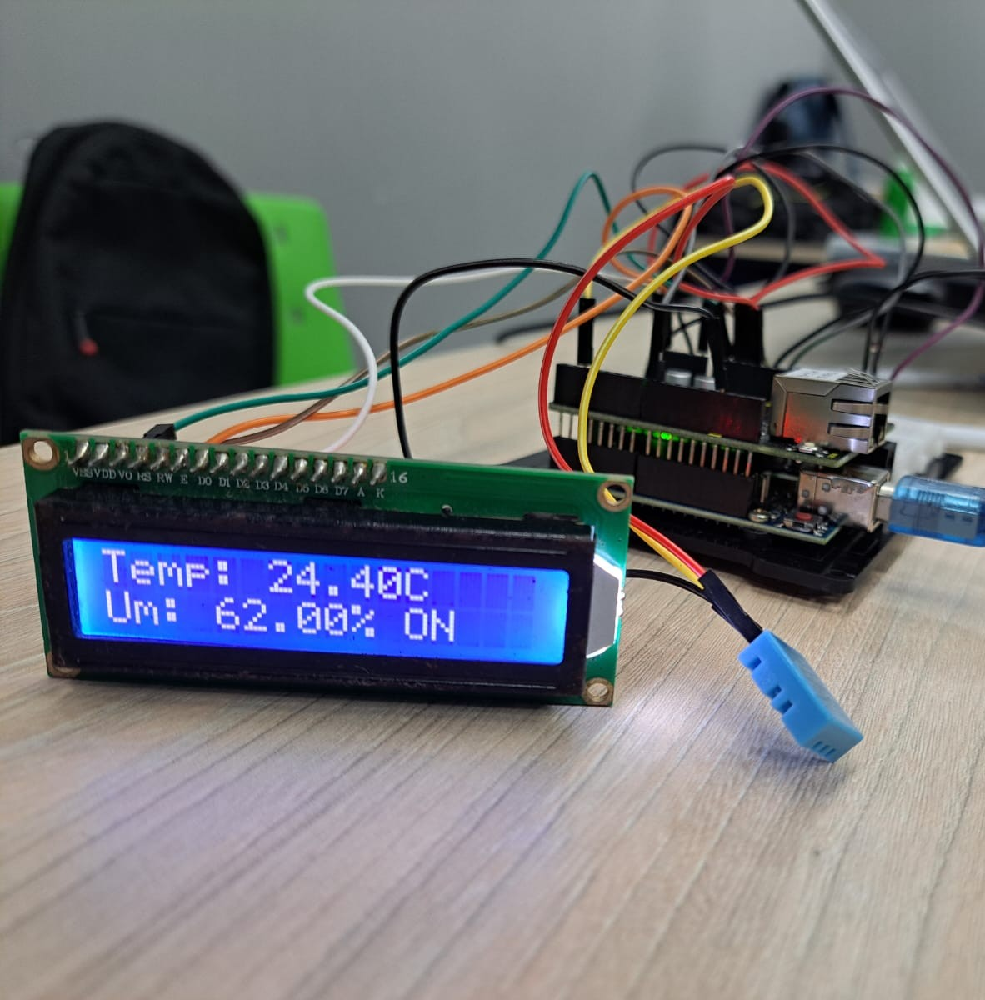
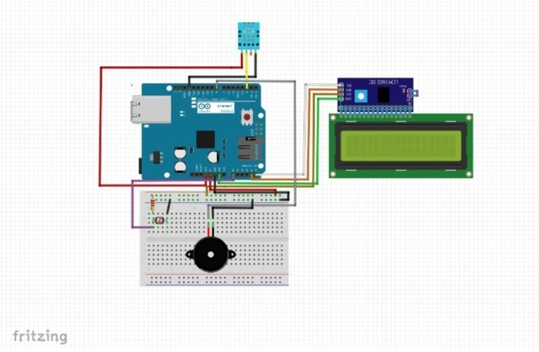

<h1 align="center">Sensor de temperatura e umidade</h1>

O projeto funciona integrado a um Arduino (uma série de microcomputadores de placa única com componentes integrados). A finalidade desse projeto é medir a temperatura e a umidade do ambiente em que está inserido, retornando o resultado no LED integrado do Arduino. Também é possível visualizar o resultado em uma página HTML e enviar pequenas mensagens para serem transmitidas no LCD integrado.

<p align="center">
  
</p>

# Arquitetura do Arduino

<table>
<tr>
<td>
<ul>
<li>Placa Arduino UNO R3</li>
<li>LDR Sensor</li>
<li>Character LCD i2c 16x02</li>
<li>Piezo Buzzer</li>
</ul>
</td>
<td>
<ul>
<li>Jumper Wire</li>
<li>Ethernet Shield</li>
<li>DHT11 sensor</li>
<li>Resistor 47.5 ohm</li>
</ul>
</td>
</tr>
</table>


<p align="center">
  
</p>

# Bibliotecas de código

- `<SPI.h>` (Serial Peripheral Interface) Permite a comunicação rápida entre o Arduino e dispositivos como módulos Ethernet, cartões SD, conversores ADC/DAC, entre outros.

```
    #include <SPI.h>
```

- `<Ethernet.h>` Permite que o Arduino se conecte a redes Ethernet e facilita a configuração e gerenciamento de conexões de rede, permitindo que o Arduino atue como um servidor ou cliente.

```
    #include <Ethernet.h>
```

- `"LiquidCrystal_I2C.h"` Controla displays LCD via interface I2C e facilita a exibição de mensagens em telas LCD 16x2, 20x4, etc., usando apenas dois pinos (SDA e SCL).

```
    #include "LiquidCrystal_I2C.h"
```

- `"Wire.h"` Permite a comunicação com sensores, módulos e outros dispositivos compatíveis com I2C (como o LCD I2C, sensores de temperatura, EEPROMs).

```
    #include "Wire.h"
```

- `"DHT.h"` Biblioteca para sensores de temperatura e umidade DHT11 e DHT22 ela fornece funções para leitura dos sensores.

```
    #include "DHT.h"
```

# Página Web

É criado um servidor web pequeno no Arduino usando o Ethernet Shield. Para acessá-lo, é necessário seguir alguns passos:

1. Conectar o Arduino à rede local
    - O Arduino deve estar conectado ao roteador via cabo Ethernet.
    - O código define o IP do Arduino como 192.168.1.180.

2. Verificar a conexão 
    - No Monitor Serial do Arduino IDE, verifique se há mensagens confirmando a inicialização do servidor.

3. Acessar a página
    - No dispositivo conectado à mesma rede do Arduino, abra o navegador e acesse o endereço: 
    ```
       http://192.168.1.180
    ```

### Licença

```
Desenvolvimento em 2024 por Pedro Ryan, Rodrigo Alves e Wesley Santos.

Este projeto está licenciado sob a licença Apache 2.0. Consulte o arquivo LICENSE para obter mais informações.
```